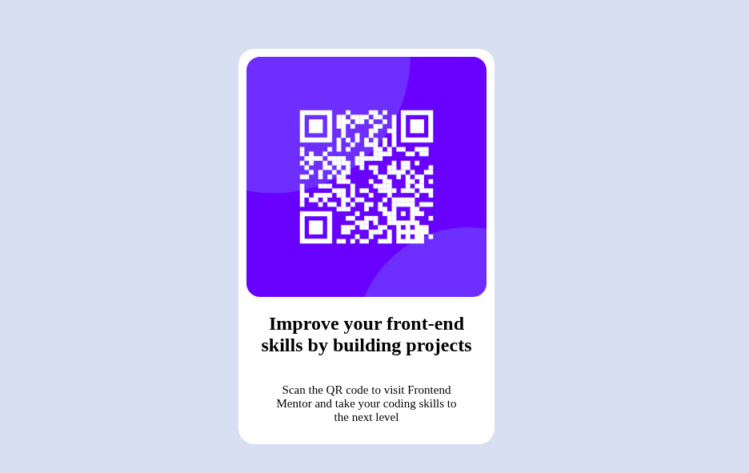

# Frontend Mentor - QR code component solution

This is a solution to the [QR code component challenge on Frontend Mentor](https://www.frontendmentor.io/challenges/qr-code-component-iux_sIO_H). Frontend Mentor challenges help you improve your coding skills by building realistic projects.

## Table of contents

- [Overview](#overview)
  - [Screenshot](#screenshot)
  - [Links](#links)
- [My process](#my-process)
  - [Built with](#built-with)
  - [What I learned](#what-i-learned)
  - [Continued development](#continued-development)
  - [Useful resources](#useful-resources)
- [Author](#author) -[Acknowledgments](#Acknowledgments)

## Overview

### Screenshot

### Links

- Solution URL: [Add solution URL here](https://github.com/matondo11/qr-code-component-main.git)
- Live Site URL: [Add live site URL here](https://matondo11.github.io/qr-code-component-main/)

## My process

### Built with

- Semantic HTML5 markup
- CSS custom properties
- Flexbox

### What I learned

In this project, I improved my knowledge of:

- Using CSS Flexbox to center elements on the screen
- Creating responsive layouts with media queries
- Working with CSS custom properties for colors and typography

### Continued development

I want to continue focusing on:

- Improving responsive design skills
- Practicing CSS Grid for more complex layouts
- Writing cleaner and more maintainable CSS

## Author

- Website - [Matondo Domingos Bunga](https://www.your-site.com)
- Frontend Mentor - [@matondo11](https://www.frontendmentor.io/profile/yourusername)

## Acknowledgments

Thanks to the Frontend Mentor community for inspiration and feedback.
